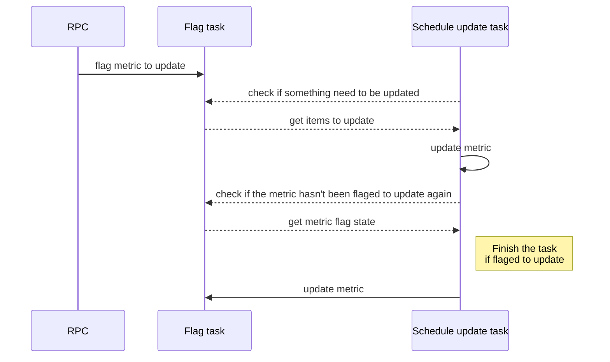

# Remote keyboard


Install

```
# clone repo to $GOPATH/src/.../.../
brew install dep
dep ensure
```

```
npm install -g parcel-bundler
npm install
parcel index.html
```


Example of mermaid

```mermaid
sequenceDiagram
    RPC->>Flag task: flag metric to update
    Schedule update task-->>Flag task: check if something need to be updated
    Flag task-->>Schedule update task: get items to update
    Schedule update task->>Schedule update task: update metric
    Schedule update task-->>Flag task: check if the metric hasn't been flaged to update again
    Flag task-->>Schedule update task: get metric flag state
    Note right of Schedule update task: Finish the task<br> if flaged to update
    Schedule update task->>Flag task: update metric
```